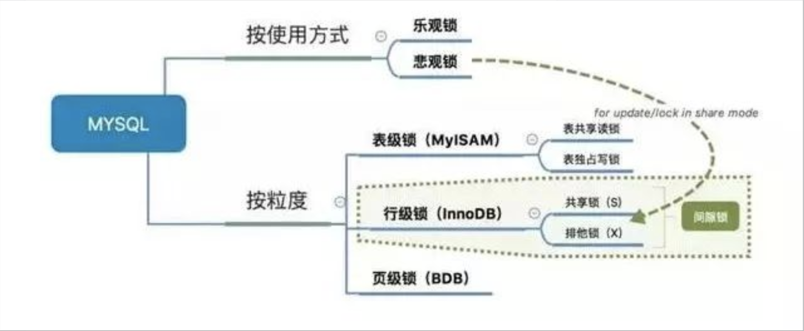
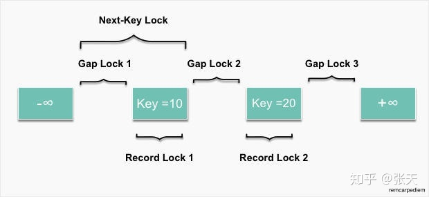
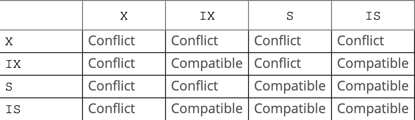

# mysql中的锁





## 三种锁




## 手动加共享锁和排他锁
    SELECT ... FOR UPDATE
    SELECT ... LOCK IN SHARE MODE


## 表级锁的兼容性

Table-level lock type compatibility is summarized in the following matrix.
、

[mysql lock](https://dev.mysql.com/doc/refman/8.0/en/innodb-locking.html)


## 意向锁
需要强调一下，意向锁是一种不与行级锁冲突表级锁，这一点非常重要。意向锁分为两种：
</br>
1. 意向共享锁（intention shared lock, IS）：事务有意向对表中的某些行加共享锁（S锁）
```
-- 事务要获取某些行的 S 锁，必须先获得表的 IS 锁。
SELECT column FROM table ... LOCK IN SHARE MODE;
```
2. 意向排他锁（intention exclusive lock, IX）：事务有意向对表中的某些行加排他锁（X锁）
```
-- 事务要获取某些行的 X 锁，必须先获得表的 IX 锁。
SELECT column FROM table ... FOR UPDATE;
```

即：意向锁是有数据引擎自己维护的，用户无法手动操作意向锁，在为数据行加共享 / 排他锁之前，InooDB 会先获取该数据行所在在数据表的对应意向锁。

## 意向锁要解决的问题
我们先来看一下百度百科上对意向锁存在意义的描述：

如果另一个任务试图在该表级别上应用共享或排它锁，则受到由第一个任务控制的表级别意向锁的阻塞。第二个任务在锁定该表前不必检查各个页或行锁，而只需检查表上的意向锁。

设想这样一张 users 表： MySql，InnoDB，Repeatable-Read：users（id PK，name）


事务 A 获取了某一行的排他锁，并未提交：

```
SELECT * FROM users WHERE id = 6 FOR UPDATE;
```

事务 B 想要获取 users 表的表锁：

```
LOCK TABLES users READ;
```
因为共享锁与排他锁互斥，所以事务 B 在视图对 users 表加共享锁的时候，必须保证：

1. 当前没有其他事务持有 users 表的排他锁。
2. 当前没有其他事务持有 users 表中任意一行的排他锁 

为了检测是否满足第二个条件，事务 B 必须在确保 users表不存在任何排他锁的前提下，去检测表中的每一行是否存在排他锁。很明显这是一个效率很差的做法，但是有了意向锁之后，情况就不一样了：

## 意向锁的兼容互斥性
意向锁是怎么解决这个问题的呢？首先，我们需要知道意向锁之间的兼容互斥性：


即意向锁之间是互相兼容的，emmm......那你存在的意义是啥？
虽然意向锁和自家兄弟互相兼容，但是它会与普通的排他 / 共享锁互斥：


注意：这里的排他 / 共享锁指的都是表锁！！！意向锁不会与行级的共享 / 排他锁互斥！！！

现在我们回到刚才 users 表的例子：

事务 A 获取了某一行的排他锁，并未提交：
```
SELECT * FROM users WHERE id = 6 FOR UPDATE;
```
此时 users 表存在两把锁：users 表上的意向排他锁与 id 为 6 的数据行上的排他锁。

事务 B 想要获取 users 表的共享锁：

```
LOCK TABLES users READ;
```
此时事务 B 检测事务 A 持有 users 表的意向排他锁，就可以得知事务 A 必然持有该表中某些数据行的排他锁，那么事务 B 对 users 表的加锁请求就会被排斥（阻塞），而无需去检测表中的每一行数据是否存在排他锁。

## 意向锁的并发性

这就牵扯到我前面多次强调的一件事情：

意向锁不会与行级的共享 / 排他锁互斥！！！
意向锁不会与行级的共享 / 排他锁互斥！！！
意向锁不会与行级的共享 / 排他锁互斥！！！

重要的话要加粗说三遍，正因为如此，意向锁并不会影响到多个事务对不同数据行加排他锁时的并发性（不然我们直接用普通的表锁就行了）。

最后我们扩展一下上面 users 表的例子来概括一下意向锁的作用（一条数据从被锁定到被释放的过程中，可能存在多种不同锁，但是这里我们只着重表现意向锁）：


事务 A 先获取了某一行的排他锁，并未提交：

```
SELECT * FROM users WHERE id = 6 FOR UPDATE;
```

1. 事务 A 获取了 users 表上的意向排他锁。
2. 事务 A 获取了 id 为 6 的数据行上的排他锁。

之后事务 B 想要获取 users 表的共享锁：
```
LOCK TABLES users READ;
```

1. 事务 B 检测到事务 A 持有 users 表的意向排他锁。
2. 事务 B 对 users 表的加锁请求被阻塞（排斥）。

最后事务 C 也想获取 users 表中某一行的排他锁：
```
SELECT * FROM users WHERE id = 5 FOR UPDATE;
```

1. 事务 C 申请 users 表的意向排他锁。
2. 事务 C 检测到事务 A 持有 users 表的意向排他锁。
3. 因为意向锁之间并不互斥，所以事务 C 获取到了 users 表的意向排他锁。
4. 因为id 为 5 的数据行上不存在任何排他锁，最终事务 C 成功获取到了该数据行上的排他锁。


## 总结
1. InnoDB 支持多粒度锁，特定场景下，行级锁可以与表级锁共存。
2. 意向锁之间互不排斥，但除了 IS 与 S 兼容外，意向锁会与 共享锁 / 排他锁 互斥。
3. IX，IS是表级锁，不会和行级的X，S锁发生冲突。只会和表级的X，S发生冲突。
4. 意向锁在保证并发性的前提下，实现了行锁和表锁共存且满足事务隔离性的要求。


## 参考
[【MySQL源码分析】浅谈Mysql的锁](https://segmentfault.com/a/1190000017076101)