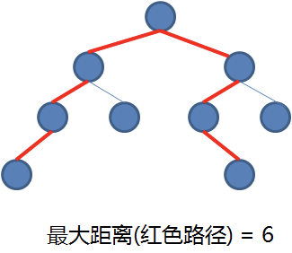

# 求二叉树中节点的最大距离
</br>

## 题目
如果我们把二叉树看成一个图，父子节点之间的连线看成是双向的，我们姑且定义"距离"为两节点之间边的个数。写一个程序求一棵二叉树中相距最远的两个节点之间的距离。


</br>
## 解法
```c++
// 数据结构定义
struct NODE
{
    NODE* pLeft;       // 左子树
    NODE* pRight;      // 右子树
    int nMaxLeft;      // 左子树中的最长距离
    int nMaxRight;     // 右子树中的最长距离
    char chValue;      // 该节点的值
};
 
int nMaxLen = 0;
 
// 寻找树中最长的两段距离
void FindMaxLen(NODE* pRoot)
{
    // 遍历到叶子节点，返回
    if(pRoot == NULL)
    {
        return;
    }
 
    // 如果左子树为空，那么该节点的左边最长距离为0
    if(pRoot -> pLeft == NULL)
    {
        pRoot -> nMaxLeft = 0;
    }
 
    // 如果右子树为空，那么该节点的右边最长距离为0
    if(pRoot -> pRight == NULL)
    {
        pRoot -> nMaxRight = 0;
    }
 
    // 如果左子树不为空，递归寻找左子树最长距离
    if(pRoot -> pLeft != NULL)
    {
        FindMaxLen(pRoot -> pLeft);
    }
 
    // 如果右子树不为空，递归寻找右子树最长距离
    if(pRoot -> pRight != NULL)
    {
        FindMaxLen(pRoot -> pRight);
    }
 
    // 计算左子树最长节点距离
    if(pRoot -> pLeft != NULL)
    {
        int nTempMax = 0;
        if(pRoot -> pLeft -> nMaxLeft > pRoot -> pLeft -> nMaxRight)
        {
            nTempMax = pRoot -> pLeft -> nMaxLeft;
        }
        else
        {
            nTempMax = pRoot -> pLeft -> nMaxRight;
        }
        pRoot -> nMaxLeft = nTempMax + 1;
    }
 
    // 计算右子树最长节点距离
    if(pRoot -> pRight != NULL)
    {
        int nTempMax = 0;
        if(pRoot -> pRight -> nMaxLeft > pRoot -> pRight -> nMaxRight)
        {
            nTempMax = pRoot -> pRight -> nMaxLeft;
        }
        else
        {
            nTempMax = pRoot -> pRight -> nMaxRight;
        }
        pRoot -> nMaxRight = nTempMax + 1;
    }
 
    // 更新最长距离
    if(pRoot -> nMaxLeft + pRoot -> nMaxRight > nMaxLen)
    {
        nMaxLen = pRoot -> nMaxLeft + pRoot -> nMaxRight;
    }
}
```