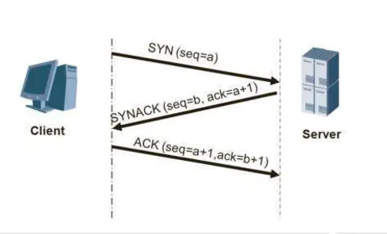
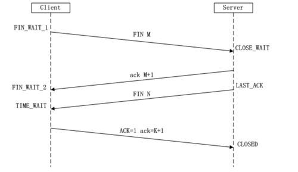

# 三次握手四次挥手

## 三次握手

## 四次挥手

## 为什么握手需要三次，挥手确是四次
    syn和ack是合并在一起的

## 为什么是三次握手，两次握手可以么？

## TIME_WAIT为啥是2msl？
    1. 可靠地实现TCP全双工连接的终止
        如果没有time_wait，那么假设最后一次ack丢了，服务端将重新发送fin，那么客户端将返回rst，服务端将会认为这是一个错误
    2. 允许老的重复分节在网络中消逝
        假设之前旧的链接的某个包在网络中拥赛了，当关闭链接之后重新打开一个新的链接，而这个旧链接的包又到了，会影响新的链接

## ACK占用序列号么？
    首先，TCP是一个面向字节流的协议，它不会对自己的内容做出任何的解释，也不需要做出解释，具体的解释由上层的协议来处理。
    其次，TCP是一个面向字节流的协议，它会对它发送的每一个字节负责，确保每一个字节都可以正确的发送。在TCP协议中，SYN与FIN字节是占用字节序列号的，因此TCP协议必须对其负责，如果他们在发送的过程中出现了任何的意外，导致最后并没有发送成功，TCP会对此进行处理（比如重传）。而ACK是不占用字节序列号的，TCP是不会对一个只含有ACK标志的TCP报文做任何保证。
    最后，直观上看，如果真的需要确认ACK，会形成一个死循环，一直反复确认。本质上说，TCP是一个面向字节流的协议，之所以不用确认ACK报文，是因为ACK报文在TCP连接中是不占用字节序列号的（当然其本身包含在TCP头部中是需要占有物理内存的，就好比卡车运沙，我们只需要确认沙子的量，而卡车则不用去关心），ACK报文本身是用来确认上次的报文是否发送成功，如果ACK出现了问题没发送到对方手中，那对方会认为自己的数据没有发送成功从而重新发送，从而导致己方再次发送ACK报文（相当于回退到两步之前，对方发送数据，己方发送ACK报文（此时再次发送ACK报文相当于ACK重传）），实际上，由于累计确认机制的存在，当己方的ACK报文发送成功时，对方继续发送新的数据报，此时该数据报中更新的字节序列号就是对之前的ACK报文的确认，只有你成功告诉我我发送成功了（ACK报文成功到达），我才会发送新的数据。